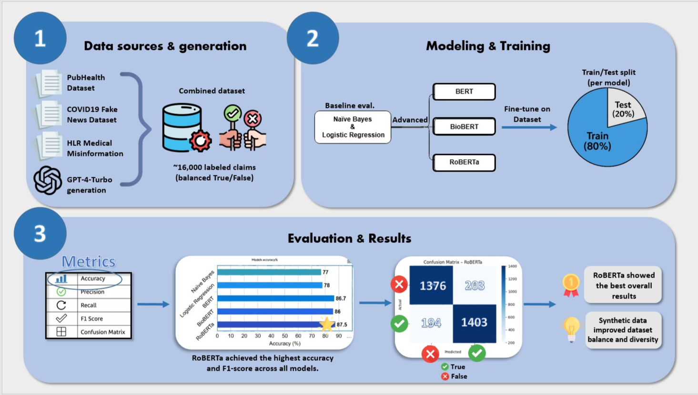

# 🧬 MedTruth: Detecting Medical Misinformation on Social Media

This project aims to detect and classify **true vs. false health-related claims** in the style of **social media posts** using **Natural Language Processing (NLP)** and **large language models (LLMs)**. The solution combines real-world labeled datasets with synthetically generated claims via GPT-4-Turbo to improve model generalization and robustness.

---

## 🎯 Goal

- Build a robust binary classifier to detect **false medical claims** on social media.
- Evaluate performance on both **real** and **synthetic** data to simulate noisy, casual online text.
- Leverage **LLMs** (BERT-based) and compare with **baseline models**.

---

## 🖼️ Visual Abstract



---

## 📦 Datasets

### 🧪 Real datasets:
- [COVID19 Fake News Dataset](https://www.kaggle.com/datasets/elvinagammed/covid19-fake-news-dataset-nlp)
- [PubHealth Dataset](https://www.kaggle.com/datasets/ersindemirel/pubhealthdataset)
- [HLR/Misinformation-Detection](https://github.com/HLR/Misinformation-Detection)

Only samples labeled as `True` or `False` were used.

### 🧠 Synthetic dataset:
- 2,300+ **synthetic false claims** were generated using **GPT-4-Turbo** via Azure OpenAI.
- Prompts were primed with COVID-related false claims to guide generation of realistic, misleading, and casual health misinformation across diverse topics.

---

## 🧬 Dataset Fields

### 📄 All training and evaluation datasets share the following structure:

| Column  | Description |
|---------|-------------|
| `claim` | Text of the medical or health-related claim (real or synthetic) |
| `label` | Ground-truth classification: either `True` or `False` |

🧠 **Note**:  
The file `final_GPTclaims.csv` contains only **synthetic false claims** that passed a quality score threshold.  
It does **not** include a `label` column since all samples are implicitly labeled as `False`.

---

## 🛠️ Models

### 🔹 Baseline Models
- **TF-IDF + Naive Bayes**
- **TF-IDF + Logistic Regression**

### 🔹 Transformer-Based Models
- **BERT**
- **BioBERT**
- **RoBERTa**

All transformers were trained using HuggingFace `Trainer` on the merged dataset (real + synthetic).

---

## 📈 Evaluation

All models were evaluated using:

- **Accuracy**, **Precision**, **Recall**, **F1-score**
- **Confusion Matrix**

Evaluations were performed on a stratified test split from the combined dataset.

> 🔸 Note: Baseline models were trained on real data only.  
> 🔹 Advanced models were trained on **real + synthetic data**.

---

## 🧪 Results Summary

| Model               | Accuracy | Precision | Recall | F1-score |
|---------------------|----------|-----------|--------|----------|
| Naive Bayes         | 0.77     | 0.78      | 0.75   | 0.75     |
| Logistic Regression | 0.78     | 0.78      | 0.76   | 0.77     |
| BERT                | 0.867    | 0.865     | 0.872  | 0.869    |
| BioBERT             | 0.860    | 0.862     | 0.859  | 0.860    |
| RoBERTa             | **0.875**| **0.874** | **0.879** | **0.876** |

> 🔹 RoBERTa achieved the best overall performance.  
> 🔸 Baseline models struggled more with recall on the minority class ("False").

---

## 🗂️ Folder Structure

```
MedTruth/
├── notebooks/
│   ├── Synthetic_claims_generation_and_scoring.ipynb
│   ├── Baseline_models.ipynb
│   └── Advanced_models_BERT_BioBERT_RoBERTa.ipynb
│
├── data/
│   ├── claims_for_eval.csv
│   ├── final_GPTclaims.csv
│   ├── dataset_final_baseline_data.csv
│   └── dataset_final_advanced_data.csv
│
├── results/
│   ├── confusion_matrix_BERT.png
│   ├── confusion_matrix_BioBERT.png
│   ├── confusion_matrix_RoBERTa.png
│   ├── confusion_matrix_logistic.png
│   ├── confusion_matrix_naive_bayes.png
│   └── graphs/
│       ├── Advanced_label_distribution.png
│       ├── Baseline_label_distribution.png
│       ├── Advanced_top_words_true_vs_false.png
│       ├── Baseline_top_words_true_vs_false.png
│       └── Baseline_f1_score_comparison.png
│
├── presentations/
│   ├── MedTruth - Proposal Presentation.pdf
│   ├── MedTruth - Interim Presentation.pdf
│   └── MedTruth - Final Presentation.pdf
│
├── visual_abstract.png
├── requirements.txt
└── README.md
```

---

## 🧾 What's Inside?

| Notebook | Description |
|----------|-------------|
| `notebooks/Synthetic_claims_generation_and_scoring.ipynb` | Generates synthetic **false medical claims** using GPT-4-Turbo and scores them across 5 criteria. Only high-scoring claims were retained. |
| `notebooks/Baseline_models.ipynb` | Trains and evaluates baseline classifiers (**Naive Bayes**, **Logistic Regression**) using TF-IDF features on real labeled claims. |
| `notebooks/Advanced_models_BERT_BioBERT_RoBERTa.ipynb` | Fine-tunes transformer models (**BERT**, **BioBERT**, **RoBERTa**) using HuggingFace on a combined dataset (real + synthetic). |

---

## 💻 Running the Code

You can run the notebooks either locally or in **Google Colab**.  
All code was developed and tested in Google Colab ✅

### 1. Clone the repository

```bash
git clone https://github.com/saramangistu/MedTruth.git
cd MedTruth
```

### 2. Install required packages

```bash
pip install -r requirements.txt
```

---

## 🧾 requirements.txt

```
transformers==4.52.4
datasets>=3.6.0
evaluate>=0.4.3
scikit-learn>=1.4.2
pandas>=2.2.2
numpy>=1.26.4
matplotlib>=3.8.4
seaborn>=0.13.2
torch>=2.3.0
nltk>=3.9.1
spacy>=3.8.5
tiktoken>=0.6.0
kagglehub>=0.1.6
backoff>=2.2.1
openai>=1.30.5
```

---

## 🚧 Limitations and Future Work

- The synthetic dataset was generated using GPT-4-Turbo without expert medical validation. Future work could include manual annotation or filtering by healthcare professionals.
- The current classification is binary (`True` / `False`). Incorporating a stance-aware or multi-class labeling scheme (e.g., "misleading", "partially false", "unverified") may improve granularity.
- All content is in English. Multilingual support could expand the applicability to global misinformation detection.
- Model evaluation was performed on balanced test sets. Real-world data may be skewed and require further adaptation strategies.

---

## 📚 Citation

If you find this project helpful in your research or work, please consider citing it:

```
@misc{medtruth2025,
  author = {Sara Mangistu, Michelle Zalevsky},
  title = {MedTruth: Detecting Medical Misinformation on Social Media},
  year = {2025},
  howpublished = {\url{https://github.com/saramangistu/MedTruth}},
  note = {GitHub repository}
}
```

---

## 🤝 Credits

- GPT-4-Turbo API access via Azure OpenAI  
- HuggingFace Transformers and Datasets  
- Seaborn & Matplotlib for visualization  
- Developed in Google Colab
